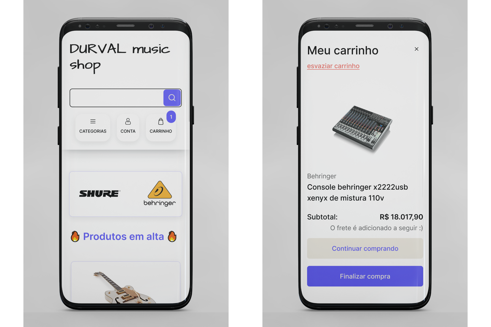

# Durval Music Shop e-commerce front-end

<hr style="border-top: 3px solid #bbb;">

## Descrição

Frontend de aplicação fullstack de um e-commerce de equipamentos musicais
onde usuários podem comprar e vender seus instrumentos.
A motivação da equipe foi de desevolver uma aplicação robusta para compor o portfólio de cada um.

<hr style="border-top: 3px solid #bbb;">

## Índice

- [Visão geral](#visão-geral)
  - [Tecnologias usadas](#tecnologias-usadas)
    - [React](#react)
    - [Outros](#outros)
  - [Funcionalidades](#funcionalidades)
  - [Design](#design)
    - [Fluxo do usuário](#fluxo-do-usuário)
  - [Links importantes](#links-importantes)
- [Estrutura do projeto](#estrutura-do-projeto)
  - [Scripts](#scripts)
  - [Dependências](#dependências)
  - [Dependências de desenvolvimento](#dependências-de-desenvolvimento)
  - [Arquitetura](#arquitetura)
- [Configuração do ambiente local](#configuração-do-ambiente-local)
  - [Instalação](#instalação)
  - [Executar o projeto](#executar-o-projeto)
  - [Arquitetura](#arquitetura)
- [Processo de trabalho](#processo-de-trabalho)
  - [Aprendizado](#aprendizado)
  - [O que desenvolver em seguida](#o-que-desenvolver-em-seguida)
  - [Fontes úteis](#fontes-úteis)
- [Créditos](#crédito)
  - [Autores](#autores)
  - [Pessoas que nos ajudaram](#pessoas-que-nos-ajudaram)

<hr style="border-top: 3px solid #bbb;">

## Visão geral

### Tecnologias usadas

#### React

- React Router Dom
- React Context
- React Hook Form

#### Outros

- Styled-components
- Radix UI
- Axios
- BrasilApi

### Funcionalidades

- Usuário sem autenticação pode criar um carrinho de compras que é salvo no Local Storage;
- Usuário logado pode criar, editar, ler ou remover:
  - Seus endereços;
  - Seus produtos anunciados;
  - Seus métodos de pagamento;
- Cadastro realizado através de um formulário de múltiplas etapas,
  melhorando a experiência do usuário;

### Design

#### Fluxo do usuário

<hr style="border-top: 3px solid #bbb;">

- Imagem 01: tela inicial da aplicação;
- Imagem 02: O carrinho que apresenta os pedidos não finalizados dele. Aqui ele pode editar, esvaziar ou finalizar a compra;



<hr style="border-top: 3px solid #bbb;">

- Imagem 03: Usuário logado dentro de sua dashboard;
- Imagem 04: Login, que é um formulário em várias
  etapas. Primeiro email e em seguida senha;


<hr style="border-top: 3px solid #bbb;">

### Links importantes

- Deploy frontend: https://durval-music-shop.vercel.app/
- Deploy backend: https://loja-do-durval.onrender.com/
- Documentação do backend: https://loja-do-durval.onrender.com/doc

<hr style="border-top: 3px solid #bbb;">

## Estrutura do projeto

### Scripts

- `dev`: Inicia o ambiente de desenvolvimento usando o Vite.
- `build`: Usado para construir o aplicativo para produção.
- `lint`: Executa o ESLint para linting e correção automática.
- `preview`: Usado para pré-visualizar o aplicativo construído usando o Vite.

Execute os scripts utilizando `npm run` ou `yarn run`.

### Dependências

- `@hookform/resolvers`: ^3.3.4,
- `@radix-ui/react-dialog`: ^1.0.5,
- `@radix-ui/react-dropdown-menu`: ^2.0.6,
- `@radix-ui/react-icons`: ^1.3.0,
- `@radix-ui/react-visually-hidden`: ^1.0.3,
- `@types/cors`: ^2.8.17,
- `axios`: ^1.6.7,
- `focus-trap-react`: ^10.2.3,
- `jsonwebtoken`: ^9.0.2,
- `nanoid`: ^5.0.6,
- `react`: ^18.2.0,
- `react-dom`: ^18.2.0,
- `react-feather`: ^2.0.10,
- `react-hook-form`: ^7.50.1,
- `react-icons`: ^5.0.1,
- `react-router-dom`: ^6.22.1,
- `react-toastify`: ^10.0.4,
- `styled-components`: ^6.1.8,
- `zod`: ^3.22.4

### Dependências de desenvolvimento

- `@testing-library/jest-dom`: ^6.4.2,
- `@testing-library/react`: ^14.2.1,
- `@types/jest`: ^29.5.12,
- `@types/jsonwebtoken`: ^9.0.5,
- `@types/react`: ^18.2.56,
- `@types/react-dom`: ^18.2.19,
- `@typescript-eslint/eslint-plugin`: ^7.0.2,
- `@typescript-eslint/parser`: ^7.0.2,
- `@vitejs/plugin-react`: ^4.2.1,
- `eslint`: ^8.56.0,
- `eslint-plugin-react-hooks`: ^4.6.0,
- `eslint-plugin-react-refresh`: ^0.4.5,
- `new-component`: ^5.0.2,
- `prettier`: ^3.2.5,
- `typescript`: ^5.2.2,
- `vite`: ^5.1.

### Instalação

1. Clone o repositório (front-end):

```bash
git clone git@github.com:brunomoleta/durval-music-shop-client.git
```

2. Clone o repositório (back-end):

```bash
git clone git@github.com:brunomoleta/durval-music-shop-server.git
```

Para mais informações sobre o back-end, verfique o README.md na raiz do projeto.

3. Instale as dependências:

```bash
npm install

# ou

yarn install
```

### Executar o Projeto

Execute o seguinte comando para iniciar o servidor:

```bash
# development
yarn dev

# production
yarn build
```

### Arquitetura

```
durval-music-shop-client/
│
├── node_modules/         Pacotes e dependências do projeto.
│
├── public/               Recursos públicos acessíveis diretamente.
│
├── src/                    Código-fonte da aplicação.
│   ├── assets/             Recursos estáticos como imagens, icones, etc.
│   ├── components/         Componentes reutilizáveis.
│   ├── hooks/              Hooks reutilizáveis.
│   ├── pages/              Componentes específicos de páginas.
│   ├── providers/          Componentes de gerenciamento de estado global.
│   ├── routes/             Componentes específicos de rotas.
│   ├── schemas/            Contexto de validação de dados.
│   ├── services/           Serviço de comunicação com API.
│   ├── styled-components/  Estilos globais da aplicação.
│   └── tests/              Testes unitários
│   └── types/              Tipagem dos components, funções e providers.
```

<hr style="border-top: 3px solid #bbb;">

## Processo de trabalho

- O principal componente da aplicação é o Modal;
- O usuário pode adicionar produtos a um carrinho de compras(modal) e editá-lo;
- Além disso, a criação de conta e login ocorrem através dele;
- Dentro do dashboard do usuário autenticado, as ações de
  CRUD acontecem no modal;

### Aprendizado

#### Modal

O componente Modal é usa o Radix-UI como base:

```Javascript
function Modal({
                 open,
                 onOpenChange,

                 element,
                 title = "",
                 button,
               }: IModal) {
  return (
          <Dialog.Root
                  modal={true}
                  open={open}
                  onOpenChange={onOpenChange}
          >
            <Dialog.Portal>
              <DOverLay />
              <DContent>
                <ModalHeader
                        button={button}
                        title={title}
                />
                {element}
              </DContent>
            </Dialog.Portal>
          </Dialog.Root>
  );
}
```

A fim de que este fosse o mais flexível possível,
pelo fato de receber em um momento
uma lista de elementos, em outra um formulário curto
e em um terceiro um formulário longo foi
realizado o seguinte css:

```css
export const DContent = styled(Dialog.Content)`
    /* ... */

    width: 100%;
    height: 100%;


@media ${QUERIES.tabletAndUp} {
    height: fit-content;
    width: fit-content;
}
`
```

O código acima fez com que o modal
ocupe a tela inteira quando ela tiver até 62.5rem
e ocupar o quanto for necessário
em uma maior. Dando assim um resultado visual e funcional
satisfatório em todas as situações.

### O que desenvolver em seguida

- Filtro de instrumentos após o usuário buscar o nome de um equipamento ( por preço, anúncios mais ou menos antigo);
- Dar ao usuário a possibilidade de terminar a compra;

### Fontes úteis

- [Josh Cameau's blog](https://www.joshwcomeau.com/) - Blog de frontend de um desenvolvedor sênior canadense.
  Ele ilustra com pequenos jogos e ilustrações sem perder a profundidade;
- [Radix UI](https://www.radix-ui.com/) - É uma mão na roda esta biblioteca de components não estilizados.
  O Modal e o Dropdown são baseados nele;

<hr style="border-top: 3px solid #bbb;">

## Crédito

### Autores

- Bruno Moleta;
- Gustavo Lazarin;
- Filipe Otávio;
- João Pedro;

### Pessoas que nos ajudaram

- Mestre Alex Conder (Kenzie Academy Brasil)

<hr style="border-top: 3px solid #bbb;">
